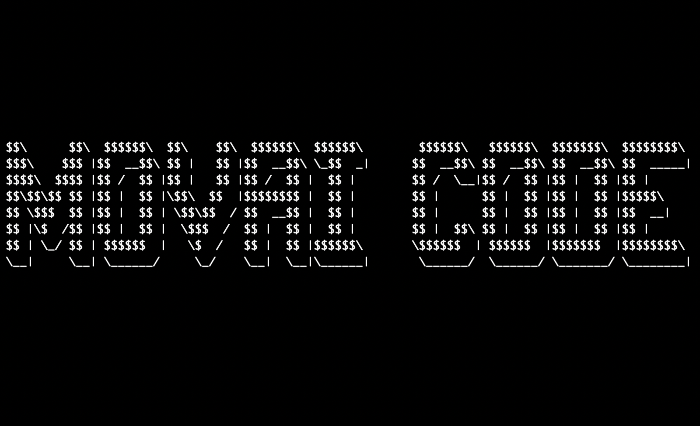

# Movai code
## Grand jeux-concours de l'année du movai code

Vous aussi vous en avez marre de vous forcer à **bien coder** alors qu’au fond, vous ne rêvez que de montrer au monde à quel point **vous pouvez être nul** ? On règle la question ici.

## Énoncé
Écrire une fonction permettant de **renverser une chaîne de caractères** (par exemple "MOVAI CODE") de la manière _la plus horrible_, _la plus honteuse_ ou _la moins optimisée_ possible.

## Langages acceptés

Tous :

 - JS,
 - Python,
 - C,
 - C++,
 - Ruby,
 - Java,
 - Go,
 - Rust,
 - C#,
 - Scala,
 - Shell,
 - Perl,
 - Flash,
 - AS400/RPG/Cobol,
 - Natural,
 - Lisp,
 - Lua,
 - UnrealScript,
 - ADA,
 - Dart,
 - Kotlin,
 - R,
 - Fortran,
 - Basic,
 - Pascal,
 - VB,
 - SQL,
 - T-SQL,
 - assembleur
 - ...
 - et même PHP
 
## Condition de succès

Cela **doit fonctionner**, le reste est accessoire. Ce qui importe, c’est que ce soit _moche_. _Hideux_. _Compliqué_. Bref _très movai_.

Note : vous pouvez tout à fait participer plusieurs fois.

## Durée

La première session se termine le **30 septembre**, pour une publication des pires réalisations début octobre.

## Gain

L’Honneur, la Gloire ou un apéro (ou non exclusif)

## Comment jouer

Au choix :

* Créez une issue et copiez/collez votre movai code, avec des commentaires si besoin, ou
* Si vous avez choisi de partir vers un projet complet, créez une issue et mentionnez le lien vers votre propre repo, ou
* Si vous préférez, créez un sous-dossier à la racine, intégrez votre code, créez une branche et lancez une PR sur dev

# BON CHANCE
