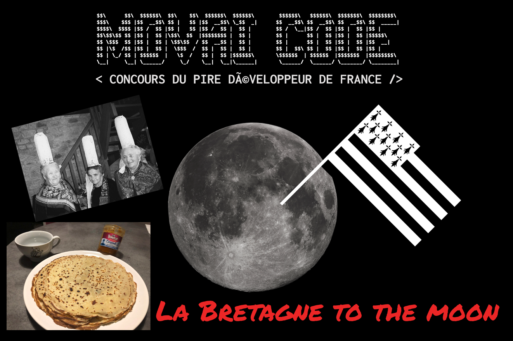

# MOVAI CODE #17 - La Bretagne to the moon

## Le concours du·de la pire développeur·euse de France

**Half-proudly by [Coddity](https://www.coddity.com/)**

Bien coder, optimiser, respecter des conventions... Y EN A MARRE !

MOVAI CODE est une **bulle d'air** pour tous·tes les développeurs·euses. L'espace d'une fonction, nous vous donnons l'occasion de vous lâcher, de montrer au monde à quel point vous pouvez être **nul·le**.

Nous vous donnons le prototype d'une fonction et c'est à vous de la définir **de la pire des manières**. Laissez libre cours à votre imagination !

Attention toutefois : IL FAUT QUE ÇA MARCHE ! Cela semble facile mais finalement pas tant que ça.

# Sujet du mois

## [TL;DR]

Calculer une surface

## La Bretagne to the moon

S'il y a bien un truc de bien que nous a donné la Bretagne, c'est le Mont Saint Michel. Non je déconne, ça, c'est la Normandie. #TROLL

Evidemment, les crêpes !

Ce mois-ci, nous vous proposons le challenge suivant : à partir d'une quantité d'ingrédients fournis, calculer la surface (en m2) pouvant être couverte par la crêpe cuisinée avec ces quantités.

(Le défi caché est de savoir combien de farine, d'oeuf, de lait, de beurre et de sucre  sont nécessaires pour recouvrir la lune d'une crèpe et d'en faire un fief breton - parce que pourquoi pas)

**Les données de départ :**
- 1 crêpe fait en moyenne 27cm de diamètre, soit 572cm2, soit 0.06m2 (arrondi)
- pour faire **1** crêpe, il faut :
  - 1/4 d'oeuf
  - 20g de farine
  - 3,5g de beurre
  - 4cl de lait
  - 1/4 de morceaux de sucre
  - (pour les plus téméraires, 1/3cl de rhum)

**To the moon**

Vous devez coder la fonction `calculSurfaceCrepe`  qui va prendre en entrée un objet `ingredients` contenant les quantités d'`oeuf`, `farine`, `beurre`, de `lait` et de `sucre` et va retourner la surface recouverte en m2 par la crêpe cuisinée avec ces quantités.

Evidemment, si vous voulez impressionner vos parents et amis, vous pouvez prendre en entrée un deuxième  paramètre : l'unité de mesure de la surface qui peut être `cm2`, `m2`, `km2` et retourner la valeur de la surface avec la bonne unité !

A vos claviers et to the moon 🚀

## Comment jouer ?

En créant une issue [sur le repo](https://github.com/CoddityTeam/movaicode/issues), avec votre movai code et des commentaires si besoin.

On ajoutera le label [movaicode/17](https://github.com/CoddityTeam/movaicode/labels/movaicode%2F17).

Date de clôture des contributions : **28 février 2023 à 23h59**

## Langages acceptés

Tous : JS, Python, C, C++, Ruby, Java, Go, Rust, C#, Scala, Shell, Perl, Flash, AS400/RPG/Cobol, Natural, Lisp, Lua, UnrealScript, ADA, Dart, Kotlin, R, Fortran, Basic, Pascal, VB, SQL, T-SQL, assembleur ... et même PHP

## Comment gagner ?

La communauté décide ! (ses bo)

Chacun peut upvote ses contributions favorites. Une semaine après la clôture, l'issue avec le plus d'upvotes gagne !

Note : vous pouvez évidemment downvote et insulter les contributions les moins movaises, mais ça ne sert à rien.

## Gain

Un t-shirt MOVAI CODE, et un apéro avec nous si vous êtes ou passez sur Paris !

# BON CHANCE
