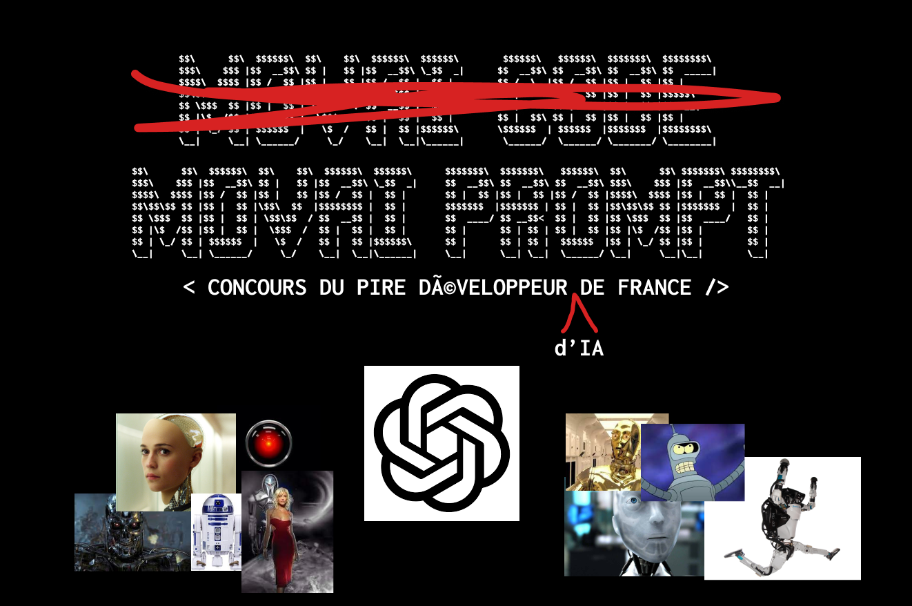
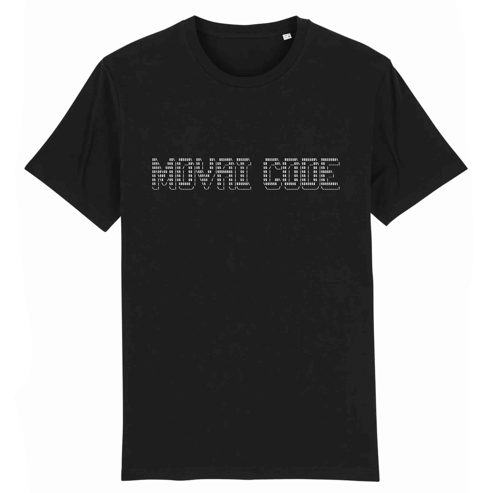

# MOVAI CODE #19 - MOVAI PROMPT (le future is là)

## Le concours du·de la pire développeur·euse de France

**Half-proudly by [Coddity](https://www.coddity.com/)**

Bien coder, optimiser, respecter des conventions... Y EN A MARRE !

MOVAI CODE est une **bulle d'air** pour tous·tes les développeurs·euses. L'espace d'une fonction, nous vous donnons l'occasion de vous lâcher, de montrer au monde à quel point vous pouvez être **nul·le**.

Nous vous donnons le prototype d'une fonction et c'est à vous de la définir **de la pire des manières**. Laissez libre cours à votre imagination !

Attention toutefois : IL FAUT QUE ÇA MARCHE ! Cela semble facile mais finalement pas tant que ça.

# Sujet du mois

## [TL;DR]

Utiliser un prompt ChatGPT pour remplacer des caractères dans une chaine.

## Prompt engineer

Ca y est, on en a tous rêvé, OpenAI l'a fait : vous donner un parfait stagiaire à portée de clic, qui va pouvoir faire vos tâches ingrates sans jamais pouvoir vous dire non (enfin pour l'instant). *(pour ceux qui ne regardent pas la TV, on parle de ChatGPT, ils en ont même parlé chez Hanouna)*

Le futur, c'est maintenant. 

Ce MOVAI CODE d'avril se transforme pour cette édition en **MOVAI PROMPT** avec un objectif simple : vous devez faire produire à ChatGPT le pire code qui soit avec quelques contraintes :
- Le code doit sortir en un seul prompt (pas de conversation)
- Vous êtes limité à la version 3.5 (celle accessible gratuitement pour l'égalité des chances)
- Le language reste au choix (vous pouvez lui demander d'en créer un)

Le sujet ? écrire une fonction qui va changer un caractère donné dans une chaine donnée par des `*`
Exemple `changerUnCaractere(leCaractereAChanger, laChaine)` avec `changerUnCaractere("o", "movai prompt")` va retourner `m*vai pr*mpt`.

Facile.

Pour les réponses nous vous demanderons (comme d'habitude en issue) :
- le prompt
- le code produit
- un screen du prompt et du code

## Comment jouer ?

En créant une issue [sur le repo](https://github.com/CoddityTeam/movaicode/issues), avec votre movai code et des commentaires si besoin.

On ajoutera le label [movaicode/19](https://github.com/CoddityTeam/movaicode/labels/movaicode%2F19).

Date de clôture des contributions : **30 avril 2023 à 23h59**

## Langages acceptés

Tous : JS, Python, C, C++, Ruby, Java, Go, Rust, C#, Scala, Shell, Perl, Flash, AS400/RPG/Cobol, Natural, Lisp, Lua, UnrealScript, ADA, Dart, Kotlin, R, Fortran, Basic, Pascal, VB, SQL, T-SQL, assembleur ... et même PHP

## Comment gagner ?

La communauté décide ! (ses bo)

Chacun peut upvote ses contributions favorites. Une semaine après la clôture, l'issue avec le plus d'upvotes gagne !

Note : vous pouvez évidemment downvote et insulter les contributions les moins movaises, mais ça ne sert à rien.

## Gain

Un t-shirt MOVAI CODE, et un apéro avec nous si vous êtes ou passez sur Paris !

# BON CHANCE
