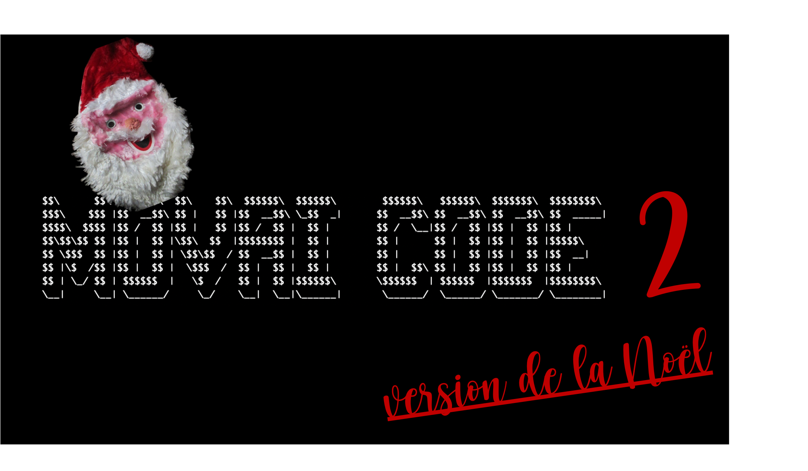

# Movai code/2 - Spécial Noël 🎅
## Grand jeux-concours de l'année du movai code

Vous aussi vous en avez marre de vous forcer à **bien coder** alors qu’au fond, vous ne rêvez que de montrer au monde à quel point **vous pouvez être nul** ? On règle la question ici.

## Retour sur Movai code/1 (sep. 2020)

Il s'agissait d'écrire une fonction permettant de **renverser une chaîne de caractères**. Bravo aux trois lauréats qui ont été très movai :

- 🏆 Lauréat - Alain pour sa méthode [qui retourne le texte](https://github.com/CoddityTeam/movaicode/issues/56)
- 🏆 Lauréat interne Coddity - Pascal pour son [code en assembleur](https://github.com/CoddityTeam/movaicode/issues/3)
- 🏆 Prix d’honneur - Pierre pour ses [9 contributions](https://github.com/CoddityTeam/movaicode/issues?q=label%3Amovaicode%2F1+author%3Apinaraf) !!

Vous pouvez retrouver les 50+ contributions [sur le repo]("https://github.com/CoddityTeam/movaicode/issues?q=label%3A%22movaicode%2F1%22+") et l'énoncé complet [sur le 1er readme]("https://github.com/CoddityTeam/movaicode/blob/master/Movaicode-1-2020-09.md")

## Énoncé du 2ème défi
Pour ce deuxième défi du Movai Code, on se plonge dans l'univers merveilleux de la Noël 🎄 et on vous propose d'écrire une fonction permettant de **compter le nombre d'occurrence de la chaîne "cadeau"** 🎁 dans une **liste de de chaîne de caractères**.

```
["cadeau", "pourri", "cadeau", "revendre", "écharpe", "transformer", "smartbox", "pyrénéens", "goldeneye64", "cadeau"]
```
devrait retourner
```
3
```

Toujours de la manière _la plus exécrable_, _la plus compliquée_ ou _la moins optimisée_ possible.

## Condition de succès

Cela **doit fonctionner**, le reste est accessoire. Ce qui importe, c’est que ce soit _moche_, _pas malin_, _très movai_.

Laissez libre court à votre imagination, ça semble facile de faire n'importe quoi mais finalement pas tant que ça.

Note : vous pouvez tout à fait participer plusieurs fois.

## Durée

La deuxième et dernière session de 2020 se termine le **24 décembre**, pour une publication des pires réalisations pour les fêtes.

## Gain

L’Honneur, la Gloire, un apéro (post vaccination) et un magnifique trophée fait-main.

## Comment jouer

En créant une issue [sur le repo](https://github.com/CoddityTeam/movaicode/issues), avec votre movai code et des commentaires si besoin

Ou bien via une PR ou en liant votre propre repo

Et ajoutez le label [movaicode/2](https://github.com/CoddityTeam/movaicode/issues?q=label%3Amovaicode%2F2+)

## Langages acceptés

Tous :

 - JS,
 - Python,
 - C,
 - C++,
 - Ruby,
 - Java,
 - Go,
 - Rust,
 - C#,
 - Scala,
 - Shell,
 - Perl,
 - Flash,
 - AS400/RPG/Cobol,
 - Natural,
 - Lisp,
 - Lua,
 - UnrealScript,
 - ADA,
 - Dart,
 - Kotlin,
 - R,
 - Fortran,
 - Basic,
 - Pascal,
 - VB,
 - SQL,
 - T-SQL,
 - assembleur
 - ...
 - et même PHP


# BON CHANCE
