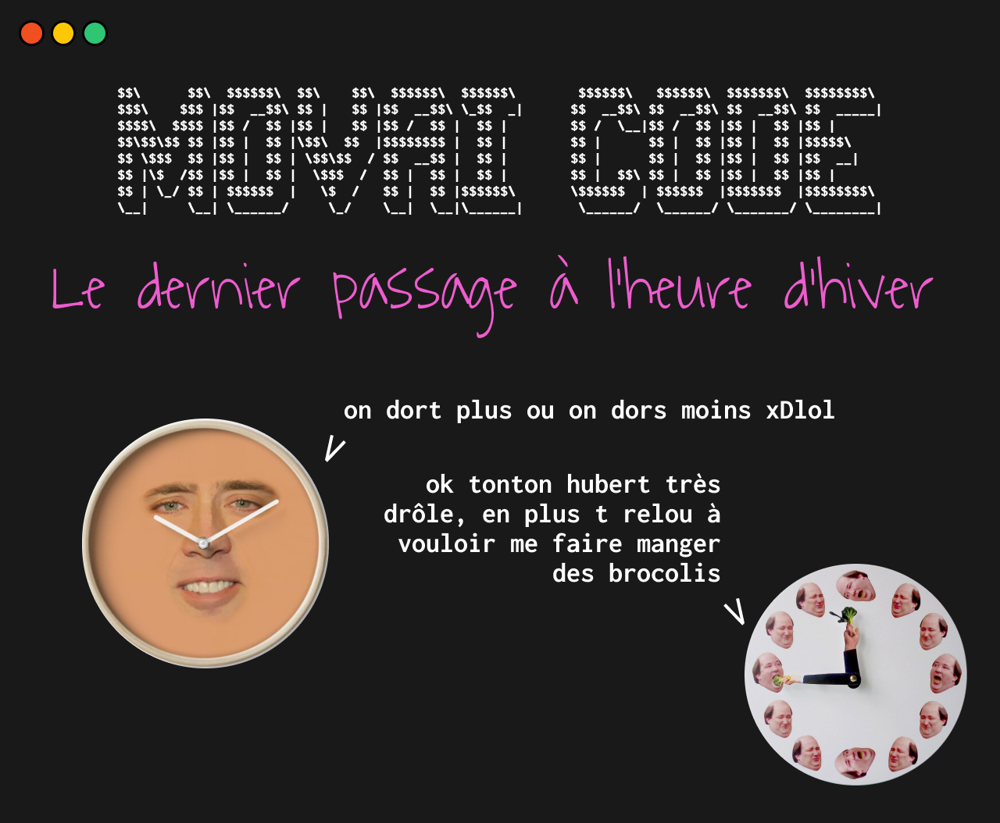

# MOVAI CODE #4 - Le dernier changement d'heure is coming (askiparé)
### Le pire concours de développement half-proudly by [Coddity](https://www.coddity.com/)


## Génèse du projet

Bien coder, optimiser, respecter des conventions... Y EN A MARRE ! 

MOVAI CODE est une bulle d'air pour tous les développeurs. L'occasion de faire faire un infarct' à Robert C. Martin et exploser son linter.

L'espace d'une fonction, nous vous donnons l'occasion de vous lâcher, de montrer au monde à quel point vous pouvez être **nul**. 


## Principe

Ce que l'on vous propose, c'est de prendre la place de l'IA de Github Copilot mais en version maléfique.

Nous vous donnons une fonction, avec ses entrées, son comportement et ses sorties attendues, et c'est à vous de la remplir **de la pire des manières**. 

Attention toutefois : IL FAUT QUE ÇA MARCHE !

Laissez libre court à votre imagination, ça semble facile de faire n'importe quoi mais finalement pas tant que ça.

Note : vous pouvez tout à fait participer plusieurs fois.


## Énoncé du sujet : switch_to_l_heure_d_hiver()

Ça fait 156 ans qu'on en entend parler, apparemment c'est acté : le 31 octobre prochain se fera le dernier passage à l'heure d'hiver. 

C'est trop triste... Rendez-vous compte que nous ne prononcerons plus jamais la phrase suivante : "Mais du coup on dort plus ou on dort moins mdrrrRRrrxDrr"

Pour rendre hommage à l'heure d'été (petit ange parti trop tôt), nous vous proposons d'écrire la fonction suivante : 

```python
def switch_to_l_heure_d_hiver(heure_d_ete: datetime) -> datetime:

    ''' 
    Entrée : une date à l'heure d'été
    Comportement : recule la date donnée d'une heure
    Sortie : une date à l'heure d'hiver
    '''

    pass
```

_Et bien évidemment, de la manière la plus exécrable, la plus compliquée ou la moins optimisée possible._
​

## Date de clôture des contributions : 31 octobre à 3h00 (ou à 2h00 ses pareilles vu ke ses leur allakel on change lol)


## Gain

Un t-shirt MOVAI CODE floqué de votre code (existe aussi en blanc), et un apéro avec nous si vous êtes ou passez sur Paris !


## Comment jouer ? 

En créant une issue [sur le repo](https://github.com/CoddityTeam/movaicode/issues), avec votre movai code et des commentaires si besoin.

On ajoutera le label [movaicode/5](https://github.com/CoddityTeam/movaicode/labels/movaicode%2F5)


## Comment gagner ?

La communauté décide ! (ses bo)

Chacun peut upvote ses contributions favorites. Une semaine après la clôture des contributions, l'issue avec le plus d'upvotes gagne ! 

Note : vous pouvez évidemment downvote et insulter les contributions les moins movaises, mais c'est méchant et ça ne sert à rien.


## Langages acceptés

Tous :
 - JS,
 - Python,
 - C,
 - C++,
 - Ruby,
 - Java,
 - Go,
 - Rust,
 - C#,
 - Scala,
 - Shell,
 - Perl,
 - Flash,
 - AS400/RPG/Cobol,
 - Natural,
 - Lisp,
 - Lua,
 - UnrealScript,
 - ADA,
 - Dart,
 - Kotlin,
 - R,
 - Fortran,
 - Basic,
 - Pascal,
 - VB,
 - SQL,
 - T-SQL,
 - assembleur
 - ...
 - et même PHP


# BON CHANCE