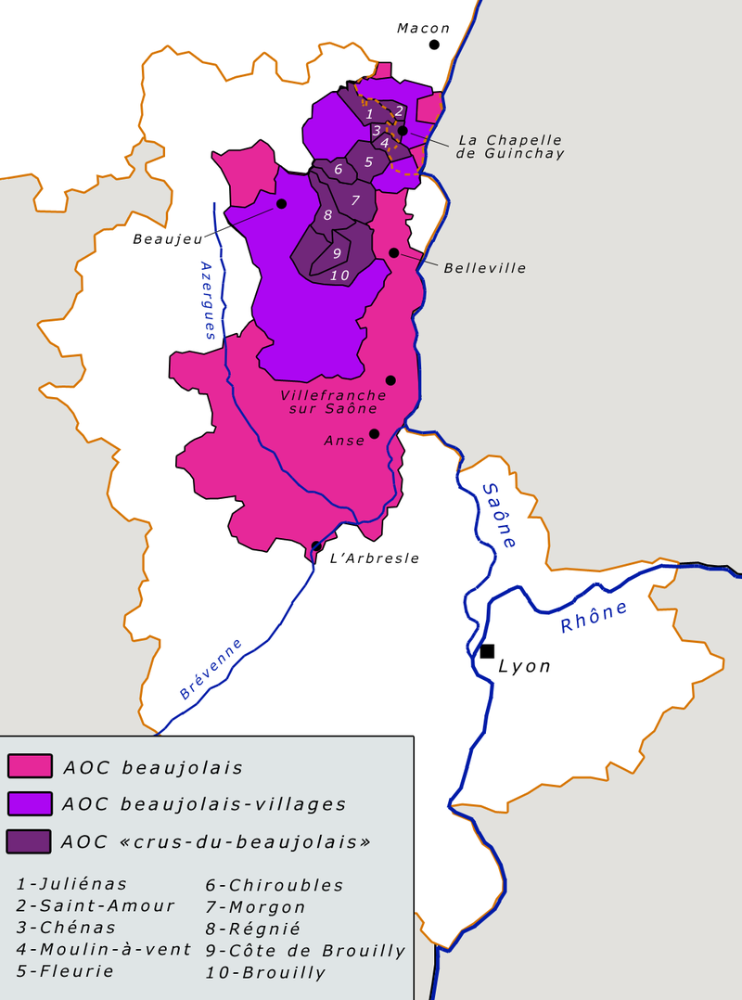

# MOVAI CODE #6 - Beaujolais nouveau is coming ! 
### Le concours du pire développeur - half-proudly by [Coddity](https://www.coddity.com/)


## Génèse du projet

Bien coder, optimiser, respecter des conventions... Y EN A MARRE ! 

MOVAI CODE est une bulle d'air pour tous les développeurs. L'occasion de faire faire un infarct' à Robert C. Martin et exploser son linter.

L'espace d'une fonction, nous vous donnons l'occasion de vous lâcher, de montrer au monde à quel point vous pouvez être **nul**. 


## Principe

Ce que l'on vous propose, c'est de prendre la place de l'IA de Github Copilot mais en version maléfique.

Nous vous donnons une fonction, avec ses entrées, son comportement et ses sorties attendues, et c'est à vous de la remplir **de la pire des manières**. 

Attention toutefois : IL FAUT QUE ÇA MARCHE !

Laissez libre court à votre imagination, ça semble facile de faire n'importe quoi mais finalement pas tant que ça.

Note : vous pouvez tout à fait participer plusieurs fois.


## Énoncé du sujet : union_des_appellations_du_beaujolais_nouveau()

Autant Halloween on est d'accord pour dire que c'est une fête commerciale, par contre celui qui crache sur le Beaujolais Nouveau va avoir à faire à nous.

Beaucoup de parallèles entre le Beaujolais Nouveau et MOVAI CODE : c'est clairement mauvais mais à chaque fois que ça sort on ne peut pas s'empêcher de se joindre à la fête.

Instant histoire-géographie (grosse dédicace à Mr. Salvi, best prof ever) : le Beaujolais Nouveau provient de différents crus issus des appellations AOC beaujolais, AOC beaujolais-village et AOC "crus-du-beaujolais", comme détaillé dans cette belle illustration.



Parce que l'union fait la force et l'onion fait la soupe, nous vous proposons d'écrire la fonction union_des_appellations_du_beaujolais_nouveau() qui prend 2 listes contenant les crus de chacune des appellations et qui retourne une liste contenant tous les crus.

```python
def union_des_appellations_du_beaujolais_nouveau(aoc_beaujolais, aoc_crus_du_beaujolais: list[str]) -> list[str]:

    ''' 
    Entrée : 2 listes de string contenant les crus de chacune des appellations
    Comportement : unie les trois listes
    Sortie : une listes de strings contenant tous les crus du Beaujolais Nouveau
    '''

    pass
```

Les trois listes : (on vous fait gagner du temps pour tester tacapté)

```python

aoc_crus_du_beaujolais = ["Julienas", "Saint-Amour", "Chénas", "Moulin-à-vent", "Fleurie", "Chiroubles", "Morgon", "Régnié", "Côte de Brouilly", "Brouilly"]
aoc_beaujolais = ["beaujolais", "beaujolais-villages"]
```

_Et bien évidemment, de la manière la plus exécrable, la plus compliquée ou la moins optimisée possible._
​

## Date de clôture des contributions : 30 novembre à 0h00
### Date de sortie du Beaujolais Nouveau (pour info) : 18 novembre 


## Gain

Un t-shirt MOVAI CODE floqué de votre code (existe aussi en blanc), et un apéro avec nous si vous êtes ou passez sur Paris !


## Comment jouer ? 

En créant une issue [sur le repo](https://github.com/CoddityTeam/movaicode/issues), avec votre movai code et des commentaires si besoin.

On ajoutera le label [movaicode/6](https://github.com/CoddityTeam/movaicode/labels/movaicode%2F6)


## Comment gagner ?

La communauté décide ! (ses bo)

Chacun peut upvote ses contributions favorites. Une semaine après la clôture des contributions, l'issue avec le plus d'upvotes gagne ! 

Note : vous pouvez évidemment downvote et insulter les contributions les moins movaises, mais c'est méchant et ça ne sert à rien.


## Langages acceptés

Tous :
 - JS,
 - Python,
 - C,
 - C++,
 - Ruby,
 - Java,
 - Go,
 - Rust,
 - C#,
 - Scala,
 - Shell,
 - Perl,
 - Flash,
 - AS400/RPG/Cobol,
 - Natural,
 - Lisp,
 - Lua,
 - UnrealScript,
 - ADA,
 - Dart,
 - Kotlin,
 - R,
 - Fortran,
 - Basic,
 - Pascal,
 - VB,
 - SQL,
 - T-SQL,
 - assembleur
 - ...
 - et même PHP


# BON CHANCE