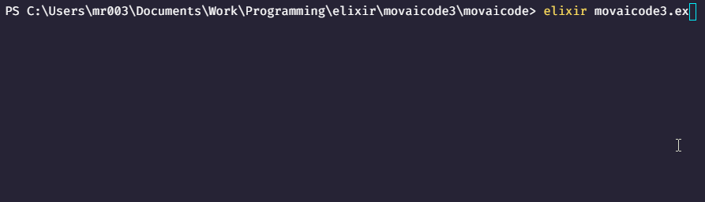

# movaicode3.ex 
Effectue un surprenament cryptique "string split" sur le thème du groupe Daft Punk.



## Elixir 🧪
Eh non, `.ex` ce n'est pas `.exe` avec un `e` en moins, mais bien l'extension de fichier d'Elixir, un langage fabuleux !

Elixir n'était pas dans la liste, mais il est si adapté à la tâche que je n'ai pu m'empécher de commettre cet exotisme.

En effet, Elixir offre des macros puissantes et une syntaxe surprenante. Pour le meilleur ... comme pour le pire.

## Pourquoi trois fichiers ?
Pour faire simple, j'ai besoin de macros pour rendre le code plus beau et rapide, donc j'ai un fichier qui les déclare de façon magnifique `macros.ex`.

Ducoup `split.ex` a besoin de `macros.ex` mais ne peut pas les importer tout seul car les macros font tomber le compilateur sous un tel charme qu'il en perd ses moyens.

Ainsi on a besoin de `movaicode3.ex` qui vient charger `macros.ex` puis `split.ex` avec beaucoup d'efficacité et de clarté.

## Comment le lancer ? 🥼
Quoi ? Vous me dites que vous n'avez jamais codé en Elixir ???
Bon, ça reste entre nous, mais intallez-le discrètement...

Une fois Elixir 1.11.2 (+ Erlang/OTP 21) installé, faites `elixir movaicode3.ex` et amusez-vous bien :)

-----
## Bonus 1 : Le string split en Elixir
Voici l'algorithme écrit de façon idiomatique et propre que j'ai implémenté dans ma participation :

```elixir
@spec split(String.t()) :: [String.t()]
def split(string) do
    string
    |> to_charlist()
    |> split_charlist()
    |> Enum.map(&(to_string(&1)))
end

@spec split_charlist(charlist()) :: [charlist()]
def split_charlist(char_list) do split_charlist_rec(char_list, [[]]) end

defp split_charlist_rec([char|next_chars], words) when [char] == ' ' do
    split_charlist_rec(next_chars, [[]|words])
end

defp split_charlist_rec([char|next_chars], [current_word|other_words]) do
    split_charlist_rec(next_chars, [current_word ++ [char]|other_words])
end

defp split_charlist_rec([], words) do Enum.reverse(words) end
```

Dans la vraie vie on fait un `String.split/1` parfaitement optimisé, les algorithmes en Elixir c'est pas trop ça...

## Bonus 2 : Les macros d'Elixir 🧩
Vous ne comprenez pas mon code ? Normal. 

Par contre vous voudriez peut-être comprendre pourquoi les macros Elixir sont la meilleur chose qui soit arrivée à l'informatique ces 20 dernières années !

Une macro, en Elixir du moins, c'est simplement un bout de code qui écrit du code lui-même.

Exemple de macro qui parlera à tous les développeurs de loggers :
```elixir
#Quelque part
defmacro log_info(string) do
    prefix = "[INFO]" 
    quote do
        IO.puts(unquote(prefix) <> "[#{ <> __MODULE__}]> " <> string)
    end
end
```
La macro ci-dessus recopie le code du print partout où on l'appelle, mais remplace un morceau par le nom du module appelant. En bref, elle a réécrit le code pour nous.

```elixir
#Dans n'importe quel autre module (pensez namespace ou classe même si c'est pas du tout pareil)
defmodule MonSuperProgramme do
#   ...
    def main() do
        log_info("hello")
    end
#   ...
end
```

Ce qui nous donne à l'appel de `MonSuperProgramme.main()`:
```
[INFO][MonSuperProgramme]> hello
```

## Bonus 3 : Pourquoi il y a des `<<0, 3>> <>...` partout ???
En Elixir les modules (pensez namespace) sont référencés par des variables de type `atom`, un peu comme un membre d'une enum dans d'autres langages, sauf qu'ils n'ont pas de valeurs, ils sont juste là pour représenter quelque-chose. 

Et comme dans plusieurs langages les membres d'enums peuvent être représentés par leur nom sous forme de String. En Elixir il suffit de rajouter `:` juste avant une String pour obtenir un atom.

En elixir les modules de la librairie standard sont des atoms du type `Elixir.<insérer nom module>`, par exemple `Elixir.String` (dans le code on a des raccourcis, on peut juste faire `String`). Ducoup on peut appeler les fonctions de `String` en faisant `:"Elixir.String".lafonction()`.

Or, en Elixir les Strings sont manipulables comme des `bitstring`, des listes d'octets représentées par `<<octet0_en_base_10, octet1_en_base_10, octet2_en_base_10 ...>>` et on peut concaténer ces listes avec l'opérateur `<>`.

Bref, dans le code je voulais compliquer la vie du lecteur alors j'ai appelé la librairie standard à l'aide des strings des modules sous forme de `bitstring`.

Petit trick : `"mon string" <> <<0>>` permet de voir un string sous forme de `bitstring`.

## Bonus 4 : C'est quoi |> ?
En Elixir `ma_variable |> ma_fonction()` équivaut à faire `ma_fonction(ma_variable)`. Cela ne fonctionne que pour le premier paramètre.