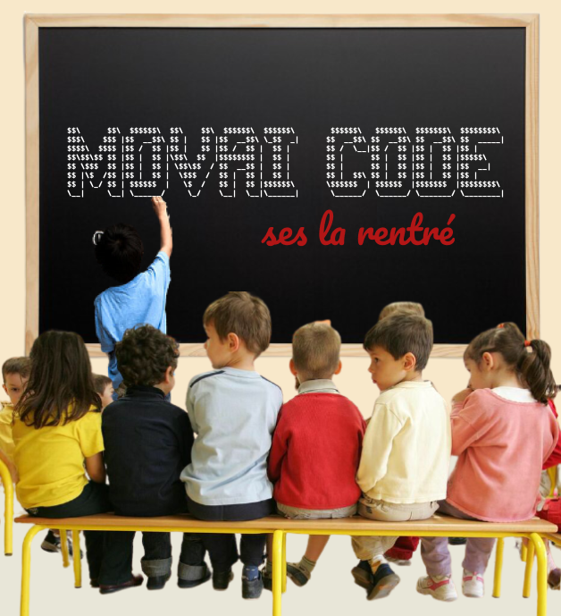

# MOVAI CODE #4 - Ses la rentré scolère
### Le pire concours de développement half-proudly by [Coddity](https://www.coddity.com/)


## Génèse du projet

Bien coder, optimiser, respecter des conventions... Y EN A MARRE ! 

MOVAI CODE est une bulle d'air pour tous les développeurs. L'occasion de faire faire un infarct' à Robert C. Martin et exploser son linter.

L'espace d'une fonction, nous vous donnons l'occasion de vous lâcher, de montrer au monde à quel point vous pouvez être **nul**. 


## Principe

Ce que l'on vous propose, c'est de prendre la place de l'IA de Github Copilot mais en version maléfique.

Nous vous donnons une fonction, avec ses entrées, son comportement et ses sorties attendues, et c'est à vous de la remplir **de la pire des manières**. 

Attention toutefois : IL FAUT QUE ÇA MARCHE !

Laissez libre court à votre imagination, ça semble facile de faire n'importe quoi mais finalement pas tant que ça.

Note : vous pouvez tout à fait participer plusieurs fois.


## Énoncé du sujet : is_there_mon_BFF_dans_ma_classe()

On va pas se mentir, on la connait tous cette angoisse de la rentrée... le moment où on découvre sa classe, avec qui on va partager l'année. 

Et le stress ultime c'est de savoir si on va être dans la même classe que son meilleur copain/copine, que l'on nomera BFF - pour Best Friend Forever <3
​

Nous vous proposons d'écrire la fonction suivante : 

```python
def is_there_mon_BFF_dans_ma_classe(liste_des_eleves):

    // Entrée : un tableau contenant des chaines de caractères
    // Comportement : recherche la présence de la string "Jean-BFF <3" dans le tableau
    // Sortie : true si "Jean-BFF <3" est dans la liste, false sinon

    pass
```

_Et bien évidemment, de la manière la plus exécrable, la plus compliquée ou la moins optimisée possible._
​

## Date de clôture des contributions : 31 septembre à 23h59


## Gain

Un t-shirt MOVAI CODE floqué de votre code (existe aussi en blanc), et un apéro avec nous si vous êtes ou passez sur Paris !


## Comment jouer ? 

En créant une issue [sur le repo](https://github.com/CoddityTeam/movaicode/issues), avec votre movai code et des commentaires si besoin.

On ajoutera le label [movaicode/4](https://github.com/CoddityTeam/movaicode/labels/movaicode%2F4)


## Comment gagner ?

La communauté décide ! (ses bo)

Chacun peut upvote ses contributions favorites. Une semaine après la clôture des contributions, l'issue avec le plus d'upvotes gagne ! 

Note : vous pouvez évidemment downvote et insulter les contributions les moins movaises, mais c'est méchant et ça ne sert à rien.


## Langages acceptés

Tous :
 - JS,
 - Python,
 - C,
 - C++,
 - Ruby,
 - Java,
 - Go,
 - Rust,
 - C#,
 - Scala,
 - Shell,
 - Perl,
 - Flash,
 - AS400/RPG/Cobol,
 - Natural,
 - Lisp,
 - Lua,
 - UnrealScript,
 - ADA,
 - Dart,
 - Kotlin,
 - R,
 - Fortran,
 - Basic,
 - Pascal,
 - VB,
 - SQL,
 - T-SQL,
 - assembleur
 - ...
 - et même PHP


# BON CHANCE