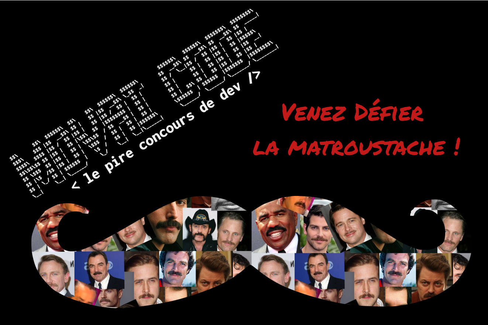

# MOVAI CODE #14 - Vive la matroustache !
# Le concours du pire développeur de France - half-proudly by [Coddity](https://www.coddity.com/)

## [TL;DR] Sujet du mois

Modifier les valeurs d'une matrice

_______________
## Génèse du projet

Bien coder, optimiser, respecter des conventions... Y EN A MARRE !

MOVAI CODE est une bulle d'air pour tous les développeurs. L'occasion de faire faire un infarct' à Robert C. Martin et exploser son linter et faire freezer Sonarqub.

L'espace d'une fonction, nous vous donnons l'occasion de vous lâcher, de montrer au monde à quel point vous pouvez être **nul**.

## Principe

Ce que l'on vous propose, c'est de prendre la place de l'IA de Github Copilot mais en version maléfique.

Nous vous donnons une fonction, avec ses entrées, son comportement et ses sorties attendues, et c'est à vous de la remplir **de la pire des manières**.

Attention toutefois : IL FAUT QUE ÇA MARCHE !

Laissez libre court à votre imagination, ça semble facile de faire n'importe quoi mais finalement pas tant que ça.

Note : vous pouvez tout à fait participer plusieurs fois.

## Énoncé du sujet : taille_de_stache()

Pour la première fois dans l’histoire de movai code, on va travailler sur une matrice !

Le mois de Novembre, c’est le mois de Movember, le mois de la moustache en signe de lutte contre le cancer de la prostate !

Mais quel est le lien entre la moustache et une matrice ??

Considérons une moustache comme une matrice de 60 poils en 10*6 (c’est une petite moustache, la moyenne des moustaches comportant 600 poils - true fact), les valeurs de chaque élément de la matrice seront la longueur du poil concerné. Notre matrice moustache est née, appelons la ***matroustache***.

Comme dans toute belle stache, les poils supérieurs sont plus grand que les poils inférieurs (oui vraiment, sinon c’est vraiment hideux), ce qui veut dire que dans un monde idéal, la ***matroustache idéale*** aurait cette forme :

```
 10  10  10  10  10  10  10  10  10  10
  9   9   9   9   9   9   9   9   9   9
  8   8   8   8   8   8   8   8   8   8
  7   7   7   7   7   7   7   7   7   7
  6   6   6   6   6   6   6   6   6   6
  5   5   5   5   5   5   5   5   5   5
```

Cependant, dans la réalité, la pousse de poils est très irrégulière, et il n’est pas rare d’avoir des poils plus longs que les autres, la ***matroustache réelle*** a plutôt cette forme là :

```
 10  10  10  15  10  12  10  11  10  10
  9  12   9   9   9   9  10   9   9   9
  8   8  10   8   9   8   8   8  10   8
  7   7   7   7  10   7   7   9   8   7
  6   8   7   6   6  10   9   8   6   6
  5   5   6   6   5   5   5  10   9   5
```

(vous remarquerez que nous n'avons pris que des poils plus longs).

“Ok d’accord, mais maintenant on quoi Jammy?”

Pour cette édition, on vous propose de coder la fonction taille_de_stache() :

- prend en entrée la ***matroustache réelle***
- doit retourner la matroustache taillée correspondant à la ***matroustache idéale***

Il y a des boucles, de l’intelligence artificielle avec des if, et si vous etes joueur, vous pouvez meme prendre le cas de poils trop courts pour une ligne donnée !

```python

matroustache_reelle = [[10,10,10,15,10,12,10,11,10,10],
                        [9,12,9,9,9,9,10,9,9,9],
                        [8,8,10,8,9,8,8,8,10,8],
                        [7,7,7,7,10,7,7,9,8,7],
                        [6,6,7,9,8,6,6,6,8,6],
                        [5,5,6,7,8,5,10,9,5,6]]

def taille_de_stache(matroustache_reelle):
  '''
  votre code ici
  '''
  return matroustache

```

Si vous avez bien suivi, le code doit nous retourner :
`>>> [[10,10,10,10,10,10,10,10,10,10],[9,9,9,9,9,9,9,9,9,9],[8,8,8,8,8,8,8,8,8,8],[7,7,7,7,7,7,7,7,7,7],[6,6,6,6,6,6,6,6,6,6],[5,5,5,5,5,5,5,5,5,5]]`

## Date de clôture des contributions : 30 novembre à 23h59

## Gain

Un t-shirt MOVAI CODE, et un apéro avec nous si vous êtes ou passez sur Paris !


## Comment jouer ?

En créant une issue [sur le repo](https://github.com/CoddityTeam/movaicode/issues), avec votre movai code et des commentaires si besoin.

On ajoutera le label [movaicode/14](https://github.com/CoddityTeam/movaicode/labels/movaicode%2F14)


## Comment gagner ?

La communauté décide ! (ses bo)

Chacun peut upvote ses contributions favorites. Une semaine après la clôture des contributions, l'issue avec le plus d'upvotes gagne !

Note : vous pouvez évidemment downvote et insulter les contributions les moins movaises, mais c'est méchant et ça ne sert à rien.


## Langages acceptés

Tous :
 - JS,
 - Python,
 - C,
 - C++,
 - Ruby,
 - Java,
 - Go,
 - Rust,
 - C#,
 - Scala,
 - Shell,
 - Perl,
 - Flash,
 - AS400/RPG/Cobol,
 - Natural,
 - Lisp,
 - Lua,
 - UnrealScript,
 - ADA,
 - Dart,
 - Kotlin,
 - R,
 - Fortran,
 - Basic,
 - Pascal,
 - VB,
 - SQL,
 - T-SQL,
 - assembleur
 - ...
 - et même PHP


# BON CHANCE
