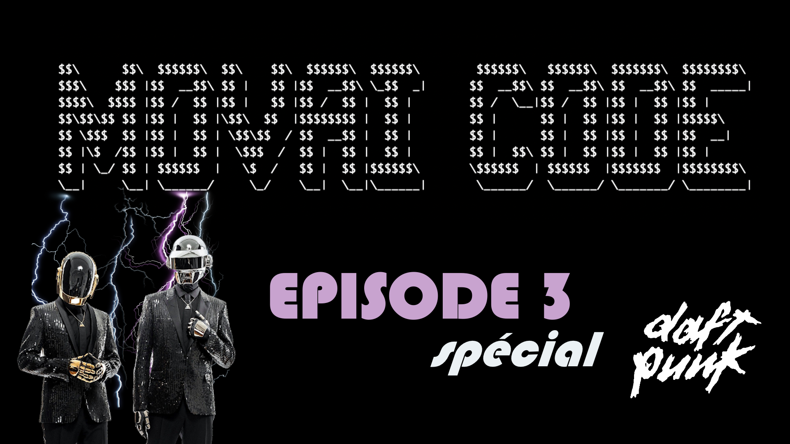

# Movai Code épisode 3 - Spécial Daft Punk
## Grand jeu-concours de développement

Vous aussi vous en avez marre de vous forcer à **bien coder** alors qu’au fond, vous ne rêvez que de montrer au monde à quel point **vous pouvez être nul** ? On règle la question ici.

## Énoncé du 3ème défi

Nous avons tous été très touchés par l'annonce de la séparation des Daft Punk 😭. C'est pourquoi nous vous proposons de revisiter la fonction .split() :
​
```
"Daft Punk"
```
devrait retourner
```
["Daft", "Punk"]
```
_Toujours de la manière la plus exécrable, la plus compliquée ou la moins optimisée possible._
​
## Condition de succès
​
Cela **doit fonctionner**, le reste est accessoire. Ce qui importe, c’est que ce soit _moche_, _pas malin_, _très movai_.

Laissez libre court à votre imagination, ça semble facile de faire n'importe quoi mais finalement pas tant que ça.

Note : vous pouvez tout à fait participer plusieurs fois.
​
## Durée

Pour éviter tout poisson d'avril, vous avez jusqu'au 31 mars pour livrer vos infamies. Aucun retard ne sera accepté.

## Gain

L’Honneur, la Gloire, un apéro (post vaccination) et un magnifique trophée fait-main.

## Comment jouer

En créant une issue [sur le repo](https://github.com/CoddityTeam/movaicode/issues), avec votre movai code et des commentaires si besoin.

Ou bien via une PR ou en liant votre propre repo

On ajoutera le label [movaicode/3](https://github.com/CoddityTeam/movaicode/issues?q=label%3Amovaicode%2F2+)

## Langages acceptés

Tous :
 - JS,
 - Python,
 - C,
 - C++,
 - Ruby,
 - Java,
 - Go,
 - Rust,
 - C#,
 - Scala,
 - Shell,
 - Perl,
 - Flash,
 - AS400/RPG/Cobol,
 - Natural,
 - Lisp,
 - Lua,
 - UnrealScript,
 - ADA,
 - Dart,
 - Kotlin,
 - R,
 - Fortran,
 - Basic,
 - Pascal,
 - VB,
 - SQL,
 - T-SQL,
 - assembleur
 - ...
 - et même PHP

# BON CHANCE