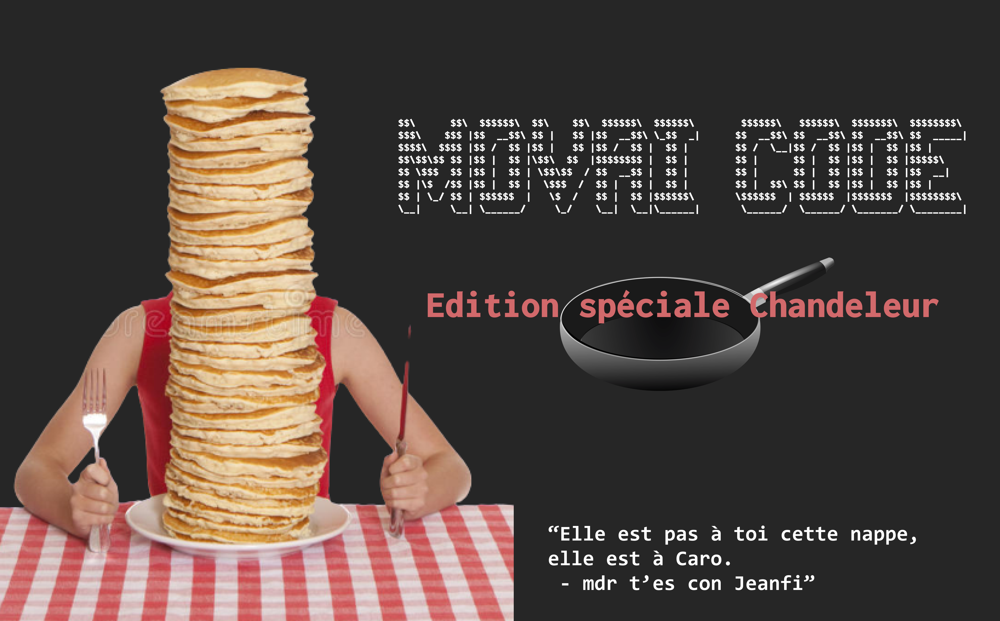

# MOVAI CODE #8 - CHANDELEUR, go manger des crêpes 
# Le concours du pire développeur de France - half-proudly by [Coddity](https://www.coddity.com/)

## [TL;DR] Sujet du mois

Retirer le dernier élément d'une liste de strings. Bisous.

_______________
## Génèse du projet

Bien coder, optimiser, respecter des conventions... Y EN A MARRE ! 

MOVAI CODE est une bulle d'air pour tous les développeurs. L'occasion de faire faire un infarct' à Robert C. Martin et exploser son linter.

L'espace d'une fonction, nous vous donnons l'occasion de vous lâcher, de montrer au monde à quel point vous pouvez être **nul**. 

## Principe

Ce que l'on vous propose, c'est de prendre la place de l'IA de Github Copilot mais en version maléfique.

Nous vous donnons une fonction, avec ses entrées, son comportement et ses sorties attendues, et c'est à vous de la remplir **de la pire des manières**. 

Attention toutefois : IL FAUT QUE ÇA MARCHE !

Laissez libre court à votre imagination, ça semble facile de faire n'importe quoi mais finalement pas tant que ça.

Note : vous pouvez tout à fait participer plusieurs fois.

## Énoncé du sujet : mange_une_crepe()

Tous à poêle ! C'est l'heure de faire des crêpes !

Mais bon, s'agit pas que de les faire, à un moment donné faut le manger eul bazar. 

Alors pour cette édition, vas y pas qu'on va se faire une petite fonction à pas piquer des hannetons qui va taper une crêpe dans l'assiette. Let me introduce you la fonction **mange_une_crepe()** qui va retirer la dernière crêpe de la pile de crêpes (une liste de N strings "crêpe"). Après vous vous la tartinez comme vous voulez, ça nous regarde pas.

```python
def mange_une_crepe(pile_de_crepes: List[str]) -> List[str]:
    '''
    Entrée : une liste de string "crêpe" représentant la pile de crêpes
    Comportement : retire la dernière "crêpe" de la pile de crêpes
    Sortie : une liste de string "crêpe" représentant la pile de crêpes restantes
    '''
    return pile_de_crepes
```

*Et bien évidemment, de la manière la plus exécrable, la plus compliquée ou la moins optimisée possible.*

## Date de clôture des contributions : 28 février à 00h00

## Gain

Un t-shirt MOVAI CODE floqué de votre code (existe aussi en blanc), et un apéro avec nous si vous êtes ou passez sur Paris !


## Comment jouer ? 

En créant une issue [sur le repo](https://github.com/CoddityTeam/movaicode/issues), avec votre movai code et des commentaires si besoin.

On ajoutera le label [movaicode/8](https://github.com/CoddityTeam/movaicode/labels/movaicode%2F8)


## Comment gagner ?

La communauté décide ! (ses bo)

Chacun peut upvote ses contributions favorites. Une semaine après la clôture des contributions, l'issue avec le plus d'upvotes gagne ! 

Note : vous pouvez évidemment downvote et insulter les contributions les moins movaises, mais c'est méchant et ça ne sert à rien.


## Langages acceptés

Tous :
 - JS,
 - Python,
 - C,
 - C++,
 - Ruby,
 - Java,
 - Go,
 - Rust,
 - C#,
 - Scala,
 - Shell,
 - Perl,
 - Flash,
 - AS400/RPG/Cobol,
 - Natural,
 - Lisp,
 - Lua,
 - UnrealScript,
 - ADA,
 - Dart,
 - Kotlin,
 - R,
 - Fortran,
 - Basic,
 - Pascal,
 - VB,
 - SQL,
 - T-SQL,
 - assembleur
 - ...
 - et même PHP


# BON CHANCE