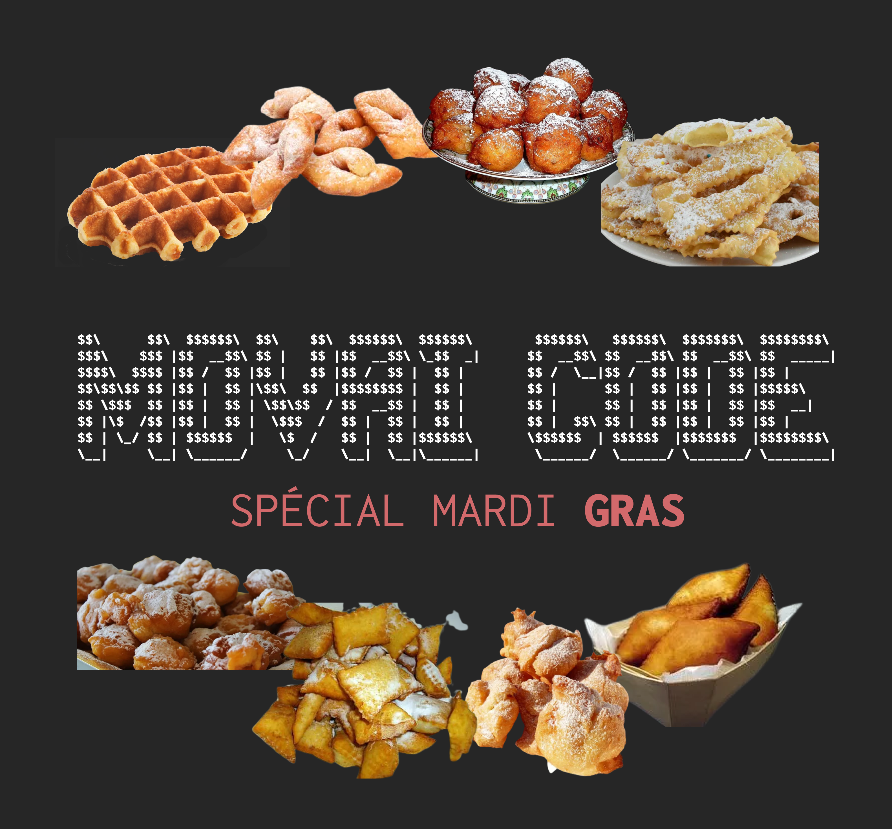

# MOVAI CODE #9 - MARDI GRAS, qu'est-ce qu'on bouffe ??
# Le concours du pire développeur de France - half-proudly by [Coddity](https://www.coddity.com/)

## [TL;DR] Sujet du mois

Récupérer un élément aléatoire d'un array de string. 

_______________
## Génèse du projet

Bien coder, optimiser, respecter des conventions... Y EN A MARRE ! 

MOVAI CODE est une bulle d'air pour tous les développeurs. L'occasion de faire faire un infarct' à Robert C. Martin et exploser son linter.

L'espace d'une fonction, nous vous donnons l'occasion de vous lâcher, de montrer au monde à quel point vous pouvez être **nul**. 

## Principe

Ce que l'on vous propose, c'est de prendre la place de l'IA de Github Copilot mais en version maléfique.

Nous vous donnons une fonction, avec ses entrées, son comportement et ses sorties attendues, et c'est à vous de la remplir **de la pire des manières**. 

Attention toutefois : IL FAUT QUE ÇA MARCHE !

Laissez libre court à votre imagination, ça semble facile de faire n'importe quoi mais finalement pas tant que ça.

Note : vous pouvez tout à fait participer plusieurs fois.

## Énoncé du sujet : choisi_une_recette_aleatoire_de_mardi_gras()

Bon clairement le mardi c'est pas ouf. Par contre le gras c'est ouf. Par voie de conséquence logique, "mardi gras" c'est pas mal ouf.

Mardi gras c'est Carnaval ([SAMBAAAAAA, DI JANEIRO](https://www.youtube.com/watch?v=HAiHEQblKeQ)) ! Mais c'est aussi la **BONNE GROSSE BOUFFE**.

Le saviez-vous ? Chaque région de notre cher terroir français a sa propre spécialité de mardi gras (gaufres dans le nord, bugnes à Lyon, oreillettes en Provence etc.).

Le problème avec ça, c'est qu'elles sont toutes aussi bonnes les unes que les autres... Alors comment choisir ? Le mieux, c'est de tirer au sort.

On vous propose donc pour cette édition d'écrire la fonction **choisi_une_recette_aleatoire_de_mardi_gras()** qui va choisir aléatoirement une spécialité régionale de Mardi Gras dans la liste de toutes les spécialités.

```python
def choisi_une_recette_aleatoire_de_mardi_gras(les_specialites_regionales_de_mardi_gras: List[str]) -> str:
    '''
    Entrée : une liste de string contenant toutes les spécialités régionales de Mardi Gras
    Comportement : séléctionne aléatoirement un élément de la liste
    Sortie : un string réprésentant la spécialité séléctionnée
    '''
    return specialite_tiree_au_hasard
```

Pour vous aider, voici la liste **les_specialites_regionales_de_mardi_gras** :

```python
les_specialites_regionales_de_mardi_gras = ["gaufres", "croustillons du ch'nord", "bugnes", "ganses", "pets de nonne", "roussettes", "merveilles", "crouchepettes", "bougnettes", "beugnot", "bottereaux", "oreillettes"]
```

*Et bien évidemment, de la manière la plus exécrable, la plus compliquée ou la moins optimisée possible.*

## Date de clôture des contributions : 31 mars à 23h59

## Gain

Un t-shirt MOVAI CODE floqué de votre code (existe aussi en blanc), et un apéro avec nous si vous êtes ou passez sur Paris !


## Comment jouer ? 

En créant une issue [sur le repo](https://github.com/CoddityTeam/movaicode/issues), avec votre movai code et des commentaires si besoin.

On ajoutera le label [movaicode/9](https://github.com/CoddityTeam/movaicode/labels/movaicode%2F9)


## Comment gagner ?

La communauté décide ! (ses bo)

Chacun peut upvote ses contributions favorites. Une semaine après la clôture des contributions, l'issue avec le plus d'upvotes gagne ! 

Note : vous pouvez évidemment downvote et insulter les contributions les moins movaises, mais c'est méchant et ça ne sert à rien.


## Langages acceptés

Tous :
 - JS,
 - Python,
 - C,
 - C++,
 - Ruby,
 - Java,
 - Go,
 - Rust,
 - C#,
 - Scala,
 - Shell,
 - Perl,
 - Flash,
 - AS400/RPG/Cobol,
 - Natural,
 - Lisp,
 - Lua,
 - UnrealScript,
 - ADA,
 - Dart,
 - Kotlin,
 - R,
 - Fortran,
 - Basic,
 - Pascal,
 - VB,
 - SQL,
 - T-SQL,
 - assembleur
 - ...
 - et même PHP


# BON CHANCE