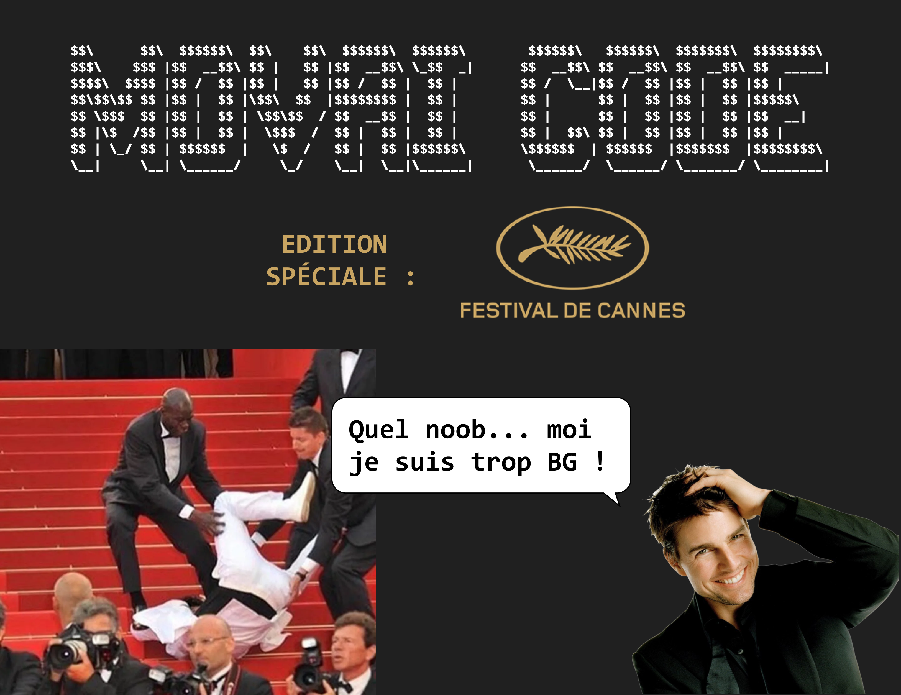

# MOVAI CODE #11 - Festival de Cannes : La montée des marches de Tom Cruise 
# Le concours du pire développeur de France - half-proudly by [Coddity](https://www.coddity.com/)

## [TL;DR] Sujet du mois

Déplacer le premier élément d'une liste en son bout.

_______________
## Génèse du projet

Bien coder, optimiser, respecter des conventions... Y EN A MARRE ! 

MOVAI CODE est une bulle d'air pour tous les développeurs. L'occasion de faire faire un infarct' à Robert C. Martin et exploser son linter.

L'espace d'une fonction, nous vous donnons l'occasion de vous lâcher, de montrer au monde à quel point vous pouvez être **nul**. 

## Principe

Ce que l'on vous propose, c'est de prendre la place de l'IA de Github Copilot mais en version maléfique.

Nous vous donnons une fonction, avec ses entrées, son comportement et ses sorties attendues, et c'est à vous de la remplir **de la pire des manières**. 

Attention toutefois : IL FAUT QUE ÇA MARCHE !

Laissez libre court à votre imagination, ça semble facile de faire n'importe quoi mais finalement pas tant que ça.

Note : vous pouvez tout à fait participer plusieurs fois.

## Énoncé du sujet : faire_monter_les_marches_de_cannes_a_tom_cruise()

Je lance les paris : qui va se casser la gueule en montant les marches du Festival de Cannes cette année et ainsi se trainer une humiliation mondiale pendant 10 ans mini qui aura un impact conséquent sur la carrière et la santé mentale de notre chuteur ? lol trop hâte

Certainement pas Tom Cruise en tout cas, il est beaucoup trop BG pour ça. Le mec escalade des gratte-ciels en pleine tempête de sable sans assurance, alors c'est pas un petit tapis rouge qui va le faire flancher. Même en escarpins Louboutin il les monte à cloche-pied.

Justement, pour ce mois de mai, nous vous proposons d'écrire la fonction **faire_monter_les_marches_de_cannes_a_tom_cruise()** qui va faire remonter la string "Tom Cruise" de l'index 0 au bout d'une liste composée de strings "marche". Peu importe les étapes intermédiaires, c'est Tom Cruise ne l'oublions pas, cet homme est incroyable et ne monte certainement pas les marches une par une.

```python
le_tapis_rouge = ["Tom Cruise", "marche", "marche", "marche", "marche", "marche", "marche"]

def faire_monter_les_marches_de_cannes_a_tom_cruise(le_tapis_rouge: List[str]) -> List[str]:
    '''
    Entrée : le_tapis_rouge une liste de string contenant "Tom Cruise" et des "marches" à monter
    Comportement : fait remonter "Tom Cruise" dans la liste "marche" par "marche"
    Sortie : le_tapis_rouge une liste de string contenant les "marches" et "Tom Cruise"
    '''
    return le_tapis_rouge
```

En gros, voilà le retour attendu :

```
>>> ["marche", "marche", "marche", "marche", "marche", "marche", "Tom Cruise"]
```

## Date de clôture des contributions : 31 mai à 23h59

## Gain

Un t-shirt MOVAI CODE floqué de votre code (existe aussi en blanc), et un apéro avec nous si vous êtes ou passez sur Paris !


## Comment jouer ? 

En créant une issue [sur le repo](https://github.com/CoddityTeam/movaicode/issues), avec votre movai code et des commentaires si besoin.

On ajoutera le label [movaicode/9](https://github.com/CoddityTeam/movaicode/labels/movaicode%2F10)


## Comment gagner ?

La communauté décide ! (ses bo)

Chacun peut upvote ses contributions favorites. Une semaine après la clôture des contributions, l'issue avec le plus d'upvotes gagne ! 

Note : vous pouvez évidemment downvote et insulter les contributions les moins movaises, mais c'est méchant et ça ne sert à rien.


## Langages acceptés

Tous :
 - JS,
 - Python,
 - C,
 - C++,
 - Ruby,
 - Java,
 - Go,
 - Rust,
 - C#,
 - Scala,
 - Shell,
 - Perl,
 - Flash,
 - AS400/RPG/Cobol,
 - Natural,
 - Lisp,
 - Lua,
 - UnrealScript,
 - ADA,
 - Dart,
 - Kotlin,
 - R,
 - Fortran,
 - Basic,
 - Pascal,
 - VB,
 - SQL,
 - T-SQL,
 - assembleur
 - ...
 - et même PHP


# BON CHANCE
