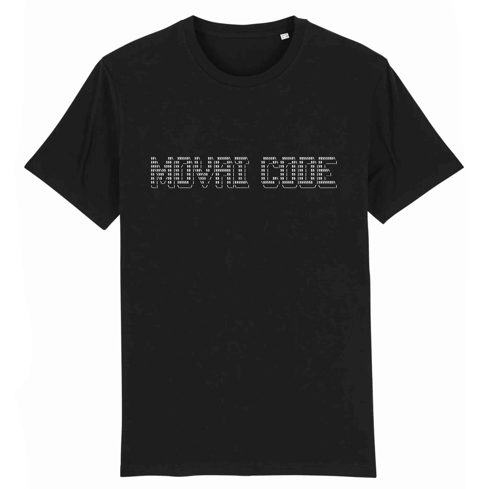

# MOVAI CODE #12 - Retour au bureau
# Le concours du pire développeur de France - half-proudly by [Coddity](https://www.coddity.com/)

## [TL;DR] Sujet du mois

Compter les éléments d'un tableau existants dans un autre tableau

_______________
## Génèse du projet

Bien coder, optimiser, respecter des conventions... Y EN A MARRE !

MOVAI CODE est une bulle d'air pour tous les développeurs. L'occasion de faire faire un infarct' à Robert C. Martin et exploser son linter et faire freezer Sonarqub.

L'espace d'une fonction, nous vous donnons l'occasion de vous lâcher, de montrer au monde à quel point vous pouvez être **nul**.

## Principe

Ce que l'on vous propose, c'est de prendre la place de l'IA de Github Copilot mais en version maléfique.

Nous vous donnons une fonction, avec ses entrées, son comportement et ses sorties attendues, et c'est à vous de la remplir **de la pire des manières**.

Attention toutefois : IL FAUT QUE ÇA MARCHE !

Laissez libre court à votre imagination, ça semble facile de faire n'importe quoi mais finalement pas tant que ça.

Note : vous pouvez tout à fait participer plusieurs fois.

## Énoncé du sujet : compteurDeMailsPrioritaires()

Ca y est ! C’est la fin de l’été ! Terminé les bouchons pour aller/partir de la plage! Terminé les p'tits jeunes altruistes qui vous font bénéficier de leurs gouts musicaux sur la plage avec des enceintes diffusant du “Jul”! Terminé la protection 50 qui colle aux doigts !

C’est le retour au bureau -__-

Et comme tout le monde, on démarre par nettoyer sa boite mail et les 357,5 messages reçus.

Alors pour ce movai code de septembre, on vous propose le défi foufou de coder la fonction compteurDeMailsPrioritaires() :

- prend en entrée la liste des adresses mails des expéditeurs qui doivent etre traités en priorité et la liste des expediteurs des mails reçus, les deux sous forme d’un tableau de string
- retourne le nombre de mails prioritaires à traiter

```go
var prioritaires = []string{”dwight@dunder-mifflin.com”,
                            “michael@dunder-mifflin.com”,
                            “phyllis@dunder-mifflin.com”,
                            }

var expediteurs = []string{”dwight@dunder-mifflin.com”,
                            “jul@totemproduction.fr”,
                            “phyllis@dunder-mifflin.com”,
                            “michael@dunder-mifflin.com”,
                            “matthieu@coddity.com”,
                            }

func compteurDeMailsPrioritaires(prioritaires, expediteurs []string) int {

// votre merveilleux code

}
```

Ce qui, pour `compteurDeMailsPrioritaires(prioritaires, expediteurs)`, nous donnerait `3`


## Date de clôture des contributions : 30 septembre à 23h59

## Gain

Un t-shirt MOVAI CODE, et un apéro avec nous si vous êtes ou passez sur Paris !




## Comment jouer ?

En créant une issue [sur le repo](https://github.com/CoddityTeam/movaicode/issues), avec votre movai code et des commentaires si besoin.

On ajoutera le label [movaicode/12](https://github.com/CoddityTeam/movaicode/labels/movaicode%2F12)


## Comment gagner ?

La communauté décide ! (ses bo)

Chacun peut upvote ses contributions favorites. Une semaine après la clôture des contributions, l'issue avec le plus d'upvotes gagne !

Note : vous pouvez évidemment downvote et insulter les contributions les moins movaises, mais c'est méchant et ça ne sert à rien.


## Langages acceptés

Tous :
 - JS,
 - Python,
 - C,
 - C++,
 - Ruby,
 - Java,
 - Go,
 - Rust,
 - C#,
 - Scala,
 - Shell,
 - Perl,
 - Flash,
 - AS400/RPG/Cobol,
 - Natural,
 - Lisp,
 - Lua,
 - UnrealScript,
 - ADA,
 - Dart,
 - Kotlin,
 - R,
 - Fortran,
 - Basic,
 - Pascal,
 - VB,
 - SQL,
 - T-SQL,
 - assembleur
 - ...
 - et même PHP


# BON CHANCE
