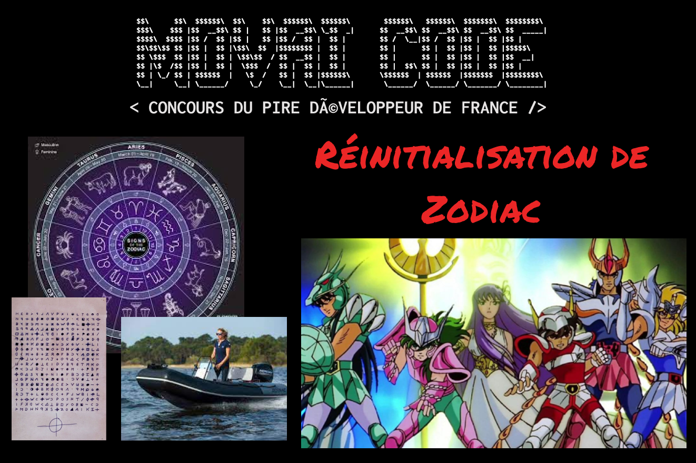

# MOVAI CODE #18 - Réinitialisation des signes astrologiques

## Le concours du·de la pire développeur·euse de France

**Half-proudly by [Coddity](https://www.coddity.com/)**

Bien coder, optimiser, respecter des conventions... Y EN A MARRE !

MOVAI CODE est une **bulle d'air** pour tous·tes les développeurs·euses. L'espace d'une fonction, nous vous donnons l'occasion de vous lâcher, de montrer au monde à quel point vous pouvez être **nul·le**.

Nous vous donnons le prototype d'une fonction et c'est à vous de la définir **de la pire des manières**. Laissez libre cours à votre imagination !

Attention toutefois : IL FAUT QUE ÇA MARCHE ! Cela semble facile mais finalement pas tant que ça.

# Sujet du mois

## [TL;DR]

Donner le signe astrologique en fonction de la date

## ["Bélier", ..., "Poisson"]

Le mois de mars, c'est un peu le mois de novembre du début de l'année. Il ne se passe RIEN, enfin presque, il y a le printemps, des giboulés et un changement d'heure. 

MAIS AUSSI c'est **la réinitialisation annuelle des signes astrologiques** !

Pour fêter ça, on vous demande de créer une fonction qui donne le signe astrologique en fonction d'une date donnée 

Pour faire simple, on part sur un format de date `JJ/MM/AAAA` (les plus téméraires peuvent choisir plusieurs format : ISO8601, Unix timestamp ou encore RFC2822)

Par souci d'équité, vous trouverez les dates officielles des signes astrologiques, publiées et validées par l'ONCAMI ([Office National des Cabinets d'Astrologie et Mediums d'Intérieur](https://www.youtube.com/watch?v=dQw4w9WgXcQ)) :

- Bélier 	21 mars - 20 avril 	♈ 	Feu
- Taureau 	21 avril - 20 mai 	♉ 	Terre
- Gémeaux 	21 mai - 21 juin 	♊ 	Air
- Cancer 	22 juin - 22 juillet 	♋ 	Eau
- Lion 	23 juillet - 22 août 	♌ 	Feu
- Vierge 	23 août - 22 septembre 	♍ 	Terre
- Balance 	23 septembre - 22 octobre 	♎ 	Air
- Scorpion 	23 octobre - 22 novembre 	♏ 	Eau
- Sagittaire 	23 novembre - 21 décembre 	♐ 	Feu
- Capricorne 	22 décembre - 20 janvier 	♑ 	Terre
- Verseau 	21 janvier - 18 février 	♒ 	Air
- Poissons 	19 février - 20 mars 	♓ 	Eau

A vos claviers 🚀

## Comment jouer ?

En créant une issue [sur le repo](https://github.com/CoddityTeam/movaicode/issues), avec votre movai code et des commentaires si besoin.

On ajoutera le label [movaicode/18](https://github.com/CoddityTeam/movaicode/labels/movaicode%2F18).

Date de clôture des contributions : **31 mars 2023 à 23h59**

## Langages acceptés

Tous : JS, Python, C, C++, Ruby, Java, Go, Rust, C#, Scala, Shell, Perl, Flash, AS400/RPG/Cobol, Natural, Lisp, Lua, UnrealScript, ADA, Dart, Kotlin, R, Fortran, Basic, Pascal, VB, SQL, T-SQL, assembleur ... et même PHP

## Comment gagner ?

La communauté décide ! (ses bo)

Chacun peut upvote ses contributions favorites. Une semaine après la clôture, l'issue avec le plus d'upvotes gagne !

Note : vous pouvez évidemment downvote et insulter les contributions les moins movaises, mais ça ne sert à rien.

## Gain

Un t-shirt MOVAI CODE, et un apéro avec nous si vous êtes ou passez sur Paris !

# BON CHANCE
