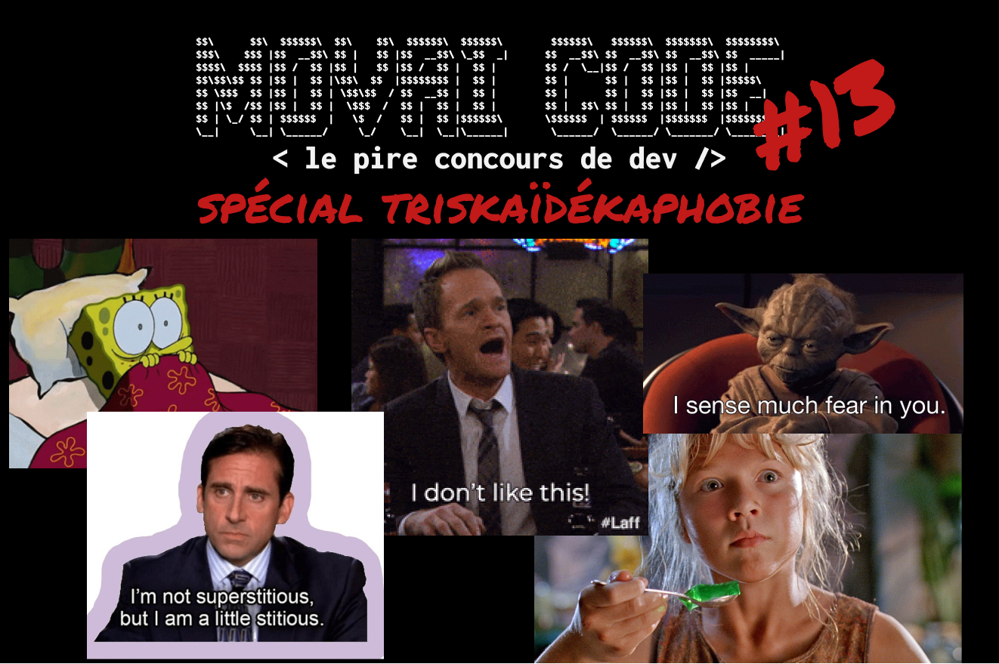
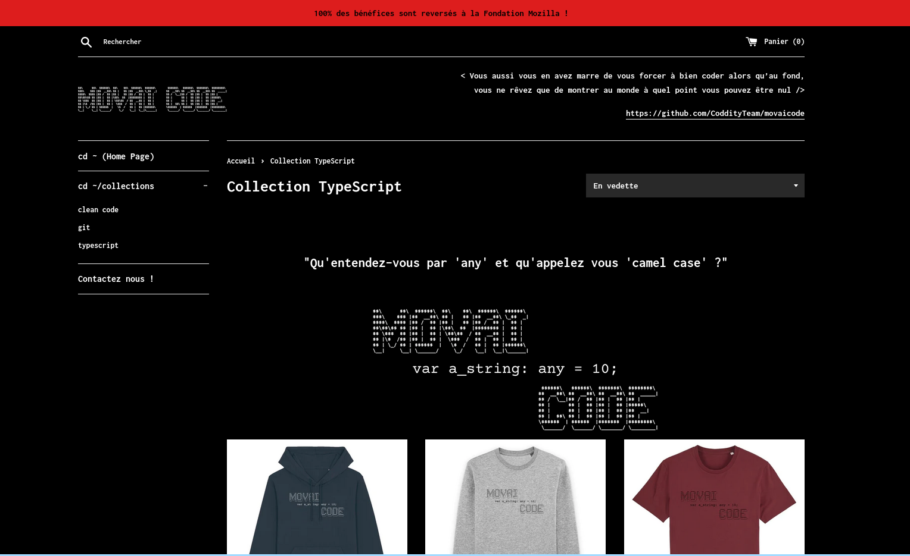

# MOVAI CODE #13 - Spécial triskaïdékaphobie !
# Le concours du pire développeur de France - half-proudly by [Coddity](https://www.coddity.com/)

## [TL;DR] Sujet du mois

Attendre 13 secondes, plus connu sous le nom de sleep() ou wait() dans les langages évolués

_______________
## Génèse du projet

Bien coder, optimiser, respecter des conventions... Y EN A MARRE !

MOVAI CODE est une bulle d'air pour tous les développeurs. L'occasion de faire faire un infarct' à Robert C. Martin et exploser son linter et faire freezer Sonarqub.

L'espace d'une fonction, nous vous donnons l'occasion de vous lâcher, de montrer au monde à quel point vous pouvez être **nul**.

## Principe

Ce que l'on vous propose, c'est de prendre la place de l'IA de Github Copilot mais en version maléfique.

Nous vous donnons une fonction, avec ses entrées, son comportement et ses sorties attendues, et c'est à vous de la remplir **de la pire des manières**.

Attention toutefois : IL FAUT QUE ÇA MARCHE !

Laissez libre court à votre imagination, ça semble facile de faire n'importe quoi mais finalement pas tant que ça.

Note : vous pouvez tout à fait participer plusieurs fois.

## Énoncé du sujet : wait13()

[le sachiez-vous ?] La triskaïdékaphobie est la peur du nombre 13 ! C’est à cause d’elle que vous ne pouvez pas être placé en 13A coté hublot dans un avion, ou avoir un appartement au 13ème étage à New York (ouais, peut etre aussi le prix 🥲), parce que, pour des raisons de superstitions, les deux n'existent pas.

Mais keskecavienfair dans un concours de movai dev ? Et bien c’est la **treizième** édition de Movai Code ! Et comme on a peur de rien, on a mis de coté l’éternel sujet autour du changement d’heure du mois d'octobre, pour vous faire plancher sur le sujet le plus simple depuis la création de Movai Code et qui, fun fact, n'a rien à voir avec la triskaïdékaphobie ! (A part vous permettre de vous la raconter auprès de votre famille/amis/collègues avec ce mot imprononcable)

Pour cette édition, on vous propose de coder la fonction **wait13()** :

- Aucune entrée
- Aucune sortie
- Attend juste 13 secondes

(Evidemment votre code peut faire plein de trucs pendant ce temps, faut juste qu'il tienne 13 secondes précisement)

```typescript

function wait13(){

// votre merveilleux code

}

```

Simple non?

## Date de clôture des contributions : 31 octobre à 23h59

## Gain

Un t-shirt MOVAI CODE, et un apéro avec nous si vous êtes ou passez sur Paris !


## Comment jouer ?

En créant une issue [sur le repo](https://github.com/CoddityTeam/movaicode/issues), avec votre movai code et des commentaires si besoin.

On ajoutera le label [movaicode/12](https://github.com/CoddityTeam/movaicode/labels/movaicode%2F13)


## Comment gagner ?

La communauté décide ! (ses bo)

Chacun peut upvote ses contributions favorites. Une semaine après la clôture des contributions, l'issue avec le plus d'upvotes gagne !

Note : vous pouvez évidemment downvote et insulter les contributions les moins movaises, mais c'est méchant et ça ne sert à rien.


## Langages acceptés

Tous :
 - JS,
 - Python,
 - C,
 - C++,
 - Ruby,
 - Java,
 - Go,
 - Rust,
 - C#,
 - Scala,
 - Shell,
 - Perl,
 - Flash,
 - AS400/RPG/Cobol,
 - Natural,
 - Lisp,
 - Lua,
 - UnrealScript,
 - ADA,
 - Dart,
 - Kotlin,
 - R,
 - Fortran,
 - Basic,
 - Pascal,
 - VB,
 - SQL,
 - T-SQL,
 - assembleur
 - ...
 - et même PHP


# Pour la bonne cause

Movai Code c'est aussi une [boutique en ligne]([https:shop](https://shop.movaicode.fr/)) vous permettant d'afficher fièrement vos compétences au quotidien. Tous les bénéfices réalisés sont reversés à la [fondation Mozilla](https://foundation.mozilla.org/fr/).

La collection couvre pour le moment:
- Clean Code
- Git
- TypeScript

A venir : PHP, JAVA, PYTHON, GOLANG



# BON CHANCE
